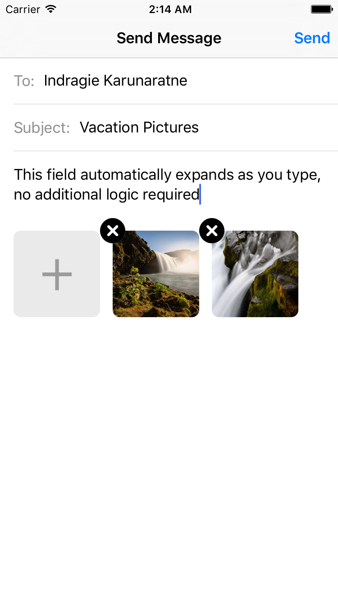

# StackViewController

### Overview

`StackViewController` is a Swift framework that simplifies the process of building forms and other static content using `UIStackView`. For example, the form below is implemented using a StackViewController:

### Design Rationale

The purpose of this project is two-fold: encouraging design patterns that are more suitable for building content like the form pictured above, and providing tools to make the process simpler. The following sections contain a summary of the existing solutions and how we can improve upon them.

#### Building Forms with `UITableView` (Is Difficult)

Traditionally, iOS developers have utilized `UITableView` to build forms and other relatively static list-based user interfaces, despite the `UITableView` API being a poor fit for such tasks. `UITableView` is designed primarily for dynamic content, and a lot of the functionality that it provides is *only necessary* for dynamic content. Using it to build static user interfaces results in a lot of boilerplate code in implementing many data source and delegate methods.

Another major issue is the difficulty of implementing variable-height content with `UITableView`. When building a form, for example, a common need is the ability to display a field (e.g. a text view) whose dimensions automatically change as the content inside it changes. One half of the problem is knowing how to size the cell — this is typically done by either manually computing the size in `-tableView:heightForRowAtIndexPath:` or by using Autolayout, estimated row heights, and the self-sizing table view cell feature introduced in iOS 8. The other half of the problem is notifying the table view that it should update the layout for a cell once the content inside the cell changes. This can involve ugly hacks like calling `-[UITableView beginUpdates]` and `-[UITableView endUpdates]` to force relayout.

The bottom line is that **`UITableView` is the wrong tool for the job**.

#### Introducing `UIStackView`

[`UIStackView`](https://developer.apple.com/library/ios/documentation/UIKit/Reference/UIStackView_Class_Reference/), introduced in iOS 9, provides a clean abstraction over Autolayout for laying out a horizontal or vertical stack of views. By composing multiple instances of `UIStackView`, the vast majority of common user interface layouts can be built quite easily without the need to manually create and remove layout constraints.

`UIStackView` is well suited for the task of building forms and other static content, but it has some shortcomings when applied to that particular use case. There are things that `UITableView` and `UITableViewController` provide that we often take for granted: scrolling support, cell separators, and other conveniences. `UIStackView` doesn't have this functionality built in, so one of the goals of this library is to fill in those key pieces of missing functionality to the point where using a stack view is *easier* than using a table view for the same task.

#### View Controllers over Views

A strong indicator of poorly designed iOS code is a bad separation of responsibilities between the view and the view controller, in accordance with the MVC (Model-View-Controller) pattern. The *Massive View Controller* anti-pattern is a common occurrence where the view controller simply does too much, absorbing responsibilities from the model and view layers. Conversely, there is also an anti-pattern where the view takes on many controller-like responsibilities rather than just focusing on the layout and rendering of the content.

`StackViewController` defines a **single** API for using both `UIView` and `UIViewController` instances to provide content. `UIView` instances can be used when the content being displayed is simple and non-interactive (e.g. a static label). `UIViewController` instances can be used for more complex controls where there needs to be a controller in addition to the view, when, for example, a view displays a visual representation of state from a model that needs to be updated as the user interacts with the view.

#### View Controller Composition

[*Composition over inheritance*](https://en.wikipedia.org/wiki/Composition_over_inheritance) is a fundamental principle of object-oriented programming. 

This principle has always been used in iOS view hierarchies, where more complex views are composed out of simpler ones (e.g. how a `UIButton` contains a `UILabel` and a `UIImageView` that render its content). However, there was no "official" way to compose view controllers until the introduction of [view controller containment](https://developer.apple.com/library/ios/featuredarticles/ViewControllerPGforiPhoneOS/ImplementingaContainerViewController.html) in iOS 5. It was possible to mimic behaviour like this prior to iOS 5, but handling the propagation of events between parent and child view controllers and transitions between child view controllers was difficult to get right, which are all problems that the view controller containment API solves.

In the same way that you can create complex layouts by composing multiple `UIStackView` instances, you can use the view controller containment API to compose multiple instances of `StackViewController` to create a hierarchy of view controllers where each content view is backed by a corresponding view controller that cleanly separates the responsibilities, instead of handling all of that at the view level (an anti-pattern, as mentioned earlier).

### Features

The framework provides two primary classes: `StackViewContainer` and `StackViewController`. `StackViewContainer` wraps a `UIStackView` and implements the following additional features:

* **Scrolling support** by embedding the `UIStackView` inside a `UIScrollView` with automatic management of associated constraints
* **Autoscroll behaviour** to automatically adjust layout and scroll to the view being edited when the keyboard appears (the same behaviour implemented by `UITableViewController`)
* **Customizable separator views** between content views that can be toggled on a per-view basis and are managed automatically when content views are inserted and removed
* Other minor conveniences like support for background views and changing the background color (since `UIStackView` doesn't draw a background)

`StackViewController` is a subclass of `UIViewController` that uses an instance of `StackViewContainer` as its view, and adds support for adding content using [view controller containment](https://developer.apple.com/library/ios/featuredarticles/ViewControllerPGforiPhoneOS/ImplementingaContainerViewController.html) (i.e. view controller composition). This means that you can use view controllers and/or views to represent your content instead of just views, and `StackViewController` automatically handles adding and removing them as child view controllers.

### Example

The included example app, pictured above, demonstrates the usage of both `StackViewContainer` on its own (the image attachment control) as well as `StackViewController` (the full form).

### License

This project is licensed under the MIT license. See `LICENSE.md` for more details.
